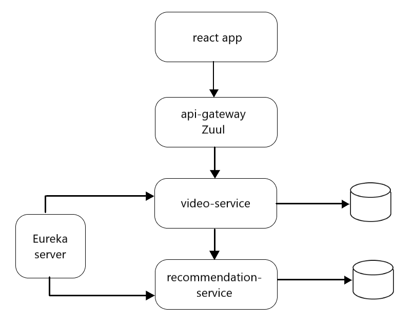

# Overview

On this website the users will see a list of videos. Each video can be viewed, embedded in the page. 

Users can leave recommendations for the videos, that consist of a rating and a comment. These recommendations can later be edited or deleted.

### Structure of the services

Basic information about the videos, like name and url, is stored in the database of the video-service.
The recommendation-service stores the details of the recommendations (rating, comment, videoId). 
The api-gateway exposes the endpoints of the video-service only. Therefore, recommendations are accessed through the video-service, which service is responsible for aggregating and returning a complete representation of the requested video, including it's recommendations.

# How to run

Using Maven: cd into all four service packages and run the following command:
<pre><code>mvn spring-boot:run</code></pre>

To start the React server at http://localhost:3000 cd into the video_info package and run:
<pre><code>npm install
npm start</code></pre>

# Under development

Add opportunity to register and login. Limit posting (updating, deleting) recommendations to authenticated users.
